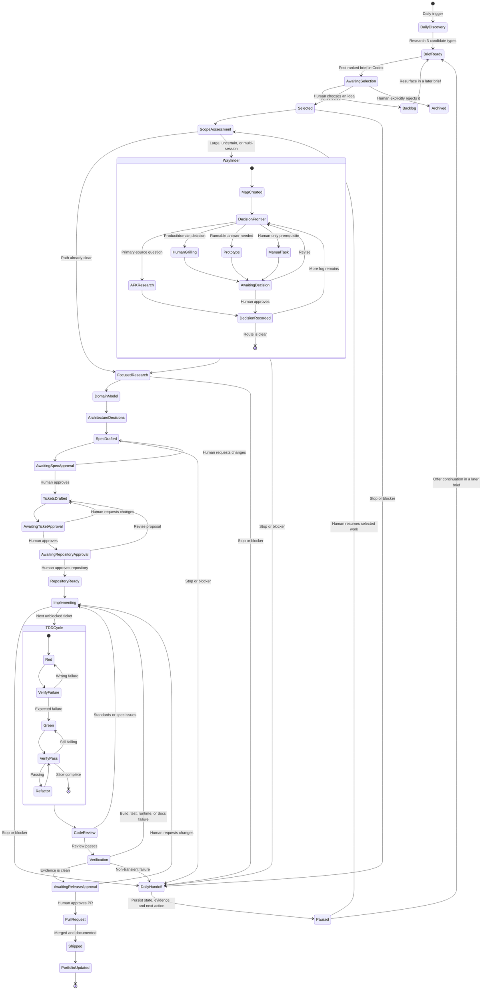

# Development State Machine

This diagram is the canonical lifecycle for Research-to-Repo. Human approval gates return to the persistent Codex control task and cannot be crossed automatically.

## Transition Rules

- A clearly transient failure may be retried once before `DailyHandoff`.
- No state transition deletes an idea or unfinished work. `Paused` retains the
  project's prior `planned`, `building`, or `blocked` progress status.
- `Archived` records an explicit rejection and can be reversed only by explicit human revival.
- `RepositoryReady`, `PullRequest`, and `Shipped` require distinct human approvals or verified events.
- A specification-only result is `planned`; partial implementation is `building`; neither is `shipped`.
- Reruns update the existing state record and dated brief rather than producing duplicates.
